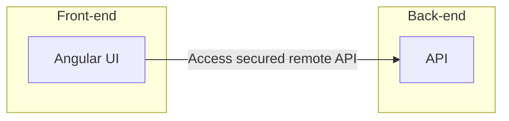
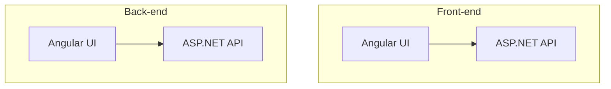
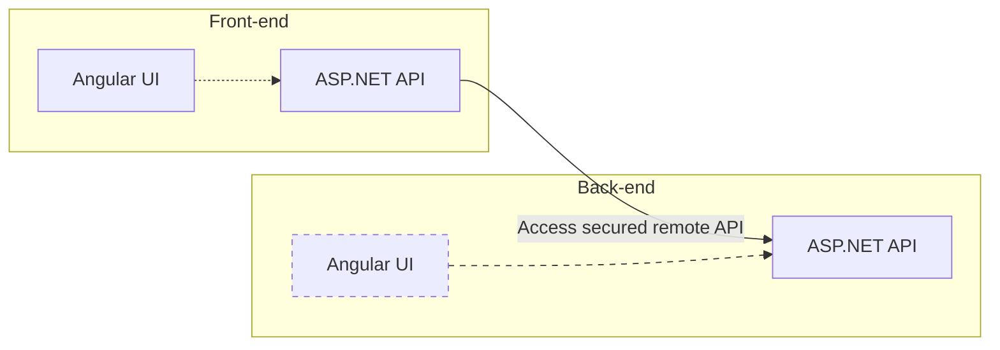
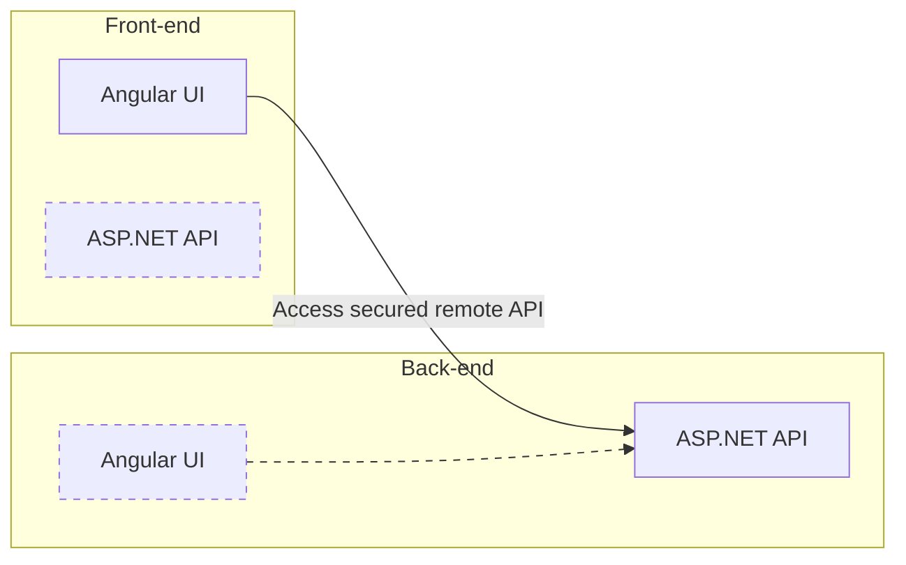
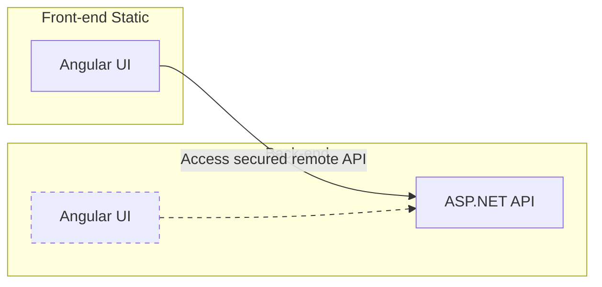
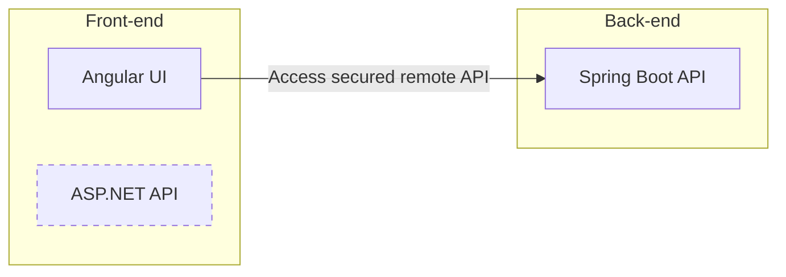
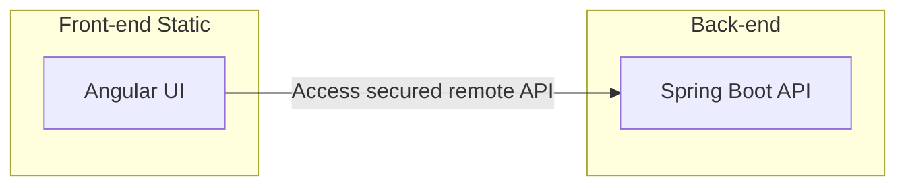
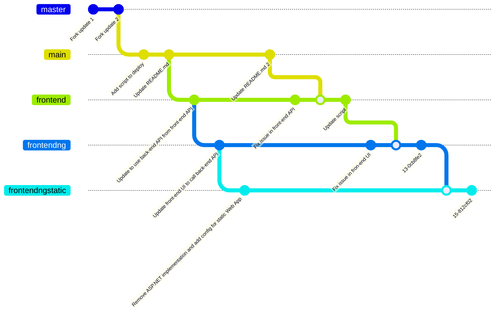

---
languages:
- csharp
- aspx-csharp
page_type: sample
description: "This is a sample application that you can use to follow along with the Run a RESTful API with CORS in Azure App Service tutorial."
products:
- azure
- aspnet-core
- azure-app-service
---

# ASP.NET Core API sample for Azure App Service

This is a sample application that you can use to follow along with the tutorial at [Tutorial: Authenticate and authorize users end-to-end in Azure App Service](https://docs.microsoft.com/en-us/azure/app-service/tutorial-auth-aad?pivots=platform-windows).

## License

See [LICENSE](https://github.com/Azure-Samples/dotnet-core-api/blob/master/LICENSE.md).

## Overview

This demo based on the sample app shows how to secure a multi-tiered app, by accessing a back-end API on behalf the authenticated user, from the front-end. The front-end is a single-page application (SPA) that is built with Angular. The back-end is an ASP.NET Core API that is secured with Azure AD. A second version of the back-end, implemented using Java and Spring Boot, is also provided.



### Main steps for e2e auhtentication setup

1. [Enable authentication and authorization for back-end Web App](https://learn.microsoft.com/en-us/azure/app-service/tutorial-auth-aad?pivots=platform-windows#enable-authentication-and-authorization-for-back-end-app) using Microsoft as identity provider. Copy the **Client ID** for later use.
2. [Do the same as step 1 for front-end Web App.](https://learn.microsoft.com/en-us/azure/app-service/tutorial-auth-aad?pivots=platform-windows#enable-authentication-and-authorization-for-front-end-app). Copy the **Client ID** for later use.
3. [Grant front-end app access to back-end](https://learn.microsoft.com/en-us/azure/app-service/tutorial-auth-aad?pivots=platform-windows#grant-front-end-app-access-to-back-end) on the user's behalf.
4. [Configure App Service to return usable access token](https://learn.microsoft.com/en-us/azure/app-service/tutorial-auth-aad?pivots=platform-windows#configure-app-service-to-return-a-usable-access-token)
5. (Optional) Add the front-end app registration as an authorized client application of the back-end: cf. Tip of the previous [step](https://learn.microsoft.com/en-us/azure/app-service/tutorial-auth-aad?pivots=platform-windows#configure-app-service-to-return-a-usable-access-token).
6. For browser app, i.e. Angular UI calling dircetly the back-end, configure [CORS](https://learn.microsoft.com/en-us/azure/app-service/tutorial-auth-aad?pivots=platform-windows#configure-cors).

### The main phases of the tutorial

0. [Isolated islands](#0-isolated-islands): The front-end and the back-end are both deployed to Azure App Service and are working as isolated islands.
1. [Call backend API from front-end](#1-call-backend-api-from-front-end): The front-end and the back-end Web App are both secured with Azure AD. The front-end is updated to access the back-end API on behalf of the authenticated user using the front-end API.
2. [Call back-end API from browser code](#2-call-back-end-api-from-browser-code): The front-end Angular UI is calling directly the back-end API on behalf of the authenticated user. CORS is enabled on the back-end API.
3. [Static Web App for the front-end](#3-static-web-app-for-the-front-end): The front-end is deployed as a static Web App containing only the Angular UI.
4. [Use Spring Boot as back-end](#4-use-spring-boot-as-back-end): Both front-ends of points 2 and 3 are used with the Java Spring Boot version of the sample API.

>**Note**
>
>- Steps 0 to 2 are the same steps as the one provided in the [tutorial](https://docs.microsoft.com/en-us/azure/app-service/tutorial-auth-aad?pivots=platform-windows) referenced above.
>- Step 3 is a new step that shows how to deploy the front-end as a static Web App.
>- Step 4 is a new step that shows how to use the Java Spring Boot version of the sample API.
>


## 0. Isolated islands

Front-end and back-end are deployed to Azure App Service. Both are deployed as isolated islands, with no direct communication between them. They are identical and comes from the _main_ branch.



The setup of the front-end and back-end can be done using the PowerShell script _01_Create_Resource.ps1_. This script will create the following resources:

- A resource group in the chosen location
- An App Service Plan in the resource group with SKU Name: B1 and SKU Tier: Basic and Linux OS
- A front-end Web App in the resource group and App Service Plan created above. This front-end Web App is configured to use the main branch in the first step of the tutorial
- A back-end Web App in the resource group and App Service Plan created above. This back-end Web App is configured to use the main branch

>**Note**
>
>Update the name and the location of the resource group, the name of the App Service Plan, the name of the Web Apps to be unique.
>


## 1. Call backend API from front-end

The front-end and the back-end Web App are both secured with Azure AD. The front-end is updated to access the back-end on behalf of the authenticated user =  the front-end Angular UI is still caling the front-end APS.NET API, but now the front-end ASP.NET API is calling the back-end API on behalf of the authenticated user.



The first modification of the [tutorial](https://docs.microsoft.com/en-us/azure/app-service/tutorial-auth-aad?pivots=platform-windows#call-back-end-api-from-front-end) is to modify the .Net code of the frontend to call the backend, to add the authentication and [call the API securely from browser code](https://docs.microsoft.com/en-us/azure/app-service/tutorial-auth-aad?pivots=platform-windows#call-api-securely-from-browser-code).

The result of this step is available in the branch _frontend_. To deploy it, you need to run the script of this branch _02_Update_Frontend.ps1_.

>**Note**
>* Update the name in the script to match the name of the front-end Web App and the resource group created in the previous step.
>* In _TodoController.cs_, the attribute __remoteUrl_ needs to be updated with the URL of the back-end Web App.

Then you can push the frontend code of the front-end remote repository using:
```
git checkout frontend
git push frontend frontend
```

## 2. Call back-end API from browser code

The front-end Angular UI is calling directly the back-end API on behalf of the authenticated user. CORS is enabled on the back-end API.



The second modification of the [tutorial](https://docs.microsoft.com/en-us/azure/app-service/tutorial-auth-aad?pivots=platform-windows#call-api-securely-from-browser-code) is to update the Angular front-end to call the backend API from browser code. It retrieves the token and set it in the service.

The result of this step is available in the branch _frontendng_. To deploy it, you need to run the script of this branch _03_Update_Frontend_NG.ps1_.

>**Note**
>* Update the name in the script to match the name of the front-end-ng Web App and the resource group created in the previous step.
>* In _index.html_, update the URL of the back-end Web App (_apiEndpoint_) to your backend URL.

Then you can push the frontendng code of the front-end-ng remote repository using:
```
git remote add frontendng <your-front-end-ng-git-repository>
git checkout frontendng
git push frontendng frontendng
```

Go back to the previous steps of the tutorial to setup the authorization for front-end-ng the same way it was done for front-end. Do not forget to enable CORS for front-end-ng.

## 3. Static Web App for the front-end

The front-end is deployed as a static Web App containing only the Angular UI.



This additional step is not part of the tutorial. It is a way to deploy the front-end as a static Web App. The result of this step is available in the branch _frontendngstatic_. To deploy it, you need to run the following command: ```az webapp up --sku B1 --html```.

>**Note**
>* Update the configuration of the configuration of  the Static Web App in _.azure/config_.
>* In _index.html_, update the URL of the back-end Web App (_apiEndpoint_) to your backend URL.

Go back to the previous steps of the tutorial to setup the authorization for the static front-end the same way it was done for front-end-ng. Do not forget to enable CORS for the static front-end.


## 4. Use Spring Boot as back-end

An alternative back-end to the ASP.NET API is a Java Spring Boot API. The front-end is still calling the back-end API on behalf of the authenticated user as it propose in [2](#2-call-back-end-api-from-browser-code) and [3](#3-static-web-app-for-the-front-end). The backend is available here: https://github.com/beluxappdev/demo-e2e-auth-azure-app-service-spring. You deploy the backend and add the authorization the same way it is done for [2](#2-call-back-end-api-from-browser-code) and [3](#3-static-web-app-for-the-front-end) respectively. Do not forget to update the _apiEndpoint_ in _index.html_ to point to the Java Spring Boot back-end instead of the ASP.NET back-end.

Call back-end API from browser code:


Static Web App for the front-end:


## Contributing

This project has adopted the [Microsoft Open Source Code of Conduct](https://opensource.microsoft.com/codeofconduct/). For more information see the [Code of Conduct FAQ](https://opensource.microsoft.com/codeofconduct/faq/) or contact [opencode@microsoft.com](mailto:opencode@microsoft.com) with any additional questions or comments.

## Branches

The branches are the following:
- master: corresponds to the master branch of the forked Github repository - https://github.com/Azure-Samples/dotnet-core-api - and the updated code to use .NET 6.
- main: is the main/default branch of the repository. It contains the changes done in the master branch. It also contains a script for to create the resources of the e2e authentication tutorial.This README.md is also updated to explain how to deploy the demo.
- frontend: contains the code of the front-end Web App that calls the back-ned API on behalf of the authenticated user from ASP.NET API.
- frontendng: contains the code of the front-end-ng Web App that calls the back-ned API on behalf of the authenticated user directly from the browser code.
- frontendngstatic: contains the code of the front-end-ng Web App that calls the back-ned API on behalf of the authenticated user directly from the browser code. The front-end is deployed as a static Web App.



Every branch is built on another branch following the steps of the tutorial and this README.md. Therefore if there is change in the master branch, all other branches needs to be updated with this changes. If there is an update in the main branch, the frontend needs to be updated and all the branches created from it too (cf. diagram above). Therefore, we have:
```
master -> main -> frontend -> frontendng -> frontendngstatic
```